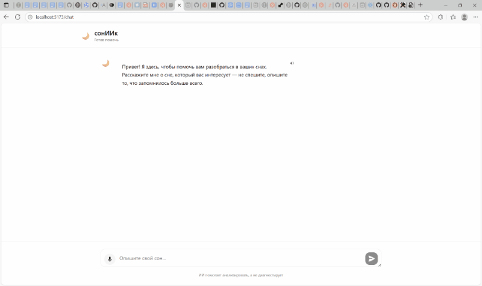

# 🌙 СоннИИк UI — Веб-интерфейс

Адаптивный веб-чат для анализа снов с поддержкой голосового ввода и персонализированной интерпретации.

---


## 🎥 Демонстрация

<div align="center">
  
  <a href='https://dreams-chatbot-front.onrender.com/'>Ссылка на деплой</a>
</div>

---

### 🌟 Особенности

- 🧠 **AI-анализ снов** через REST API
- 🎤 **Голосовой ввод** (Web Speech API)
- 🔈 **Озвучка по кнопке** (TTS, без авто-воспроизведения)
- 📚 **История и статистика** по эмоциям(в разработке)
- 🔒 **Защищённые роуты**: только зарегистрированные пользователи(в разработке)
- 📱 **Полностью адаптивный** интерфейс (мобильные + десктоп)

---

### 🛠 Технологии

- **React 18** + **TypeScript**
- **Vite** — быстрая сборка
- **TanStack Query** — управление состоянием API
- **Zustand** — глобальное состояние чата
- **Tailwind CSS** — стилизация
- **Web Speech API** — голосовой ввод и синтез речи

---

### 📦 Зависимости

- `@tanstack/react-query` — кэширование и мутации
- Кастомные хуки: `useSpeechRecognition`, `useTextToSpeech`, `usePublicInterpretation`

---

### ⚙️ Локальный запуск

```bash
# 1. Установите зависимости
npm install

# 2. Настройте .env
cp .env.example .env
# Укажите VITE_API_URL=http://localhost:3000

# 3. Запустите dev-сервер
npm run dev  # http://localhost:5173
```Ё